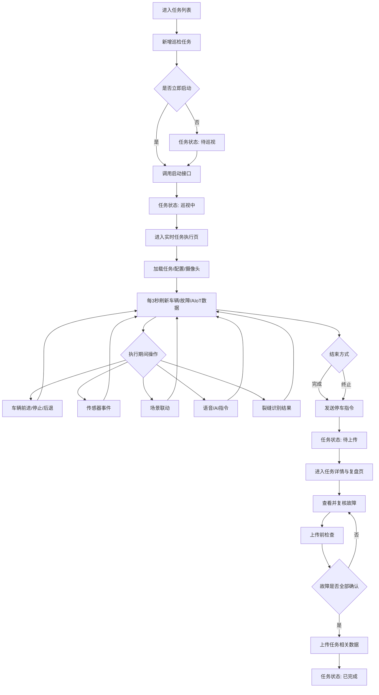
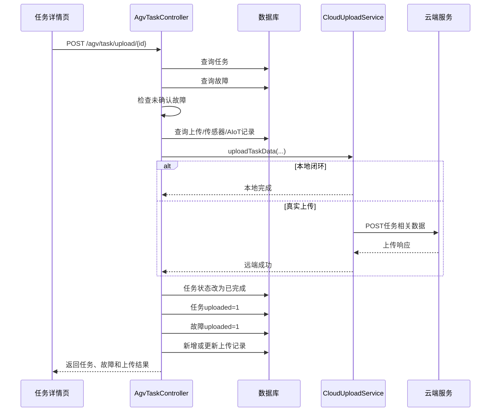

# 任务执行流程说明

## 1. 文档目的

本文档说明 AGV 巡检任务从创建、启动、实时执行、结束、复核到上传归档的完整流程，并描述任务模块与车辆控制、摄像头、故障、传感器、AIoT、AI 分析及云端上传模块之间的调用关系。

---

## 2. 完整业务流程



---

## 3. 前置条件

执行任务前应确认：

- 后端服务已经启动；
- 数据库连接正常；
- 任务状态为“待巡视”；
- 任务包含有效的起始地点和巡检距离；
- 使用真实车辆时，车辆网络和控制地址可访问；
- 使用视频监控时，摄像头服务和转流服务可访问；
- 使用课堂演示时，可以开启 Mock 或本地闭环配置。

后端默认地址：

```text
http://localhost:8088
```

---

## 4. 第一阶段：创建任务

### 4.1 打开新增任务对话框

任务列表页点击“新增任务”后，`TaskFormDialog.vue` 打开。

表单字段：

```text
任务名称
任务编号
起始地点
巡检距离
创建人
执行人
备注
巡检轮次
```

必填项包括：

```text
任务名称、任务编号、起始地点、巡检距离、创建人、执行人
```

### 4.2 自动生成编号

前端调用：

```http
GET /agv/task/next-code
```

编号示例：

```text
TASK202607100001
```

即使前端没有提供编号，后端新增接口也会再次生成。

### 4.3 保存任务

前端调用：

```http
POST /agv/task
```

保存成功后任务进入：

```text
待巡视
```

用户可以选择“创建后立即启动并进入实时巡视页”。选择后，前端保存任务成功后继续调用启动接口。

---

## 5. 第二阶段：启动任务

启动接口：

```http
POST /agv/task/start/{id}
```

后端执行：

1. 查询任务；
2. 检查任务未被逻辑删除；
3. 检查状态是否为“待巡视”；
4. 将状态改为“巡视中”；
5. 写入执行时间；
6. 返回更新后的任务。

启动成功后前端跳转到：

```text
/task/{id}/execute
```

重复启动、启动已完成任务或启动已删除任务均会被后端拒绝。

---

## 6. 第三阶段：执行页初始化

`TaskExecuteView.vue` 挂载时依次执行：

```text
loadBase()
refreshAll()
setInterval(refreshAll, 3000)
```

### 6.1 基础数据加载

`loadBase()` 加载：

- 任务详情；
- 系统配置；
- 摄像头列表。

调用接口：

```http
GET /agv/task/{id}
GET /agv/config
GET /agv/camera/devices
```

### 6.2 摄像头处理

前端优先读取摄像头设备列表；若设备接口不可用，则使用系统配置中的四路摄像头。

浏览器不能直接播放 RTSP 地址，因此前端会将摄像头 ID 转换为类似下面的 FLV 地址：

```text
{VITE_WEBRTC_BASE_URL}/live/{cameraId}_01.flv
```

执行页支持：

- 切换摄像头；
- 开启或关闭音频；
- 刷新当前视频组件。

---

## 7. 第四阶段：实时刷新

执行页每 3 秒调用一次：

```js
Promise.allSettled([
  refreshMovement(),
  refreshFlaws(),
  refreshIot()
])
```

使用 `Promise.allSettled` 的原因是：单个接口失败时，其他区域仍能继续刷新。

组件离开时会执行：

```js
clearInterval(timer)
```

避免页面离开后继续发送轮询请求。

### 7.1 车辆状态刷新

接口：

```http
GET /agv/movement/heartbeat
```

页面展示：

- 系统时间；
- 连接模式；
- 是否运行；
- 行驶方向；
- 当前巡检位置；
- 当前故障数量。

### 7.2 故障刷新

接口：

```http
GET /agv/flaw/list?taskId={id}
GET /agv/flaw/live/{id}
```

`/live/{id}` 只返回尚未弹窗提示的故障，并在返回后将其标记为已提示，避免同一故障重复弹窗。

新故障出现时，页面显示通知：

```text
发现新的故障/异常
故障名称 · 位置
```

### 7.3 AIoT 总览刷新

接口：

```http
GET /agv/iot/overview/{id}
```

返回内容包含：

- 传感器记录；
- 设备动作记录；
- 车辆状态；
- 相关总览信息。

---

## 8. 第五阶段：执行期间操作

### 8.1 车辆控制

执行页支持：

```http
POST /agv/movement/forward
POST /agv/movement/stop
POST /agv/movement/backward
```

车辆控制由后端根据配置选择：

```text
mock
http
tcp
```

真实设备联调时，应优先验证心跳和停止指令，再测试前进和后退。

### 8.2 传感器事件

前端演示按钮可以触发：

```text
温度
湿度
光照
烟雾
人员检测
```

接口：

```http
POST /agv/sensor/trigger
```

请求主要字段：

```json
{
  "taskId": 1,
  "sensorType": "humidity",
  "sensorValue": "86%",
  "distance": 120
}
```

后端可根据传感器类型和值：

- 写入传感器记录；
- 判断正常或异常；
- 生成故障记录；
- 生成 AIoT 动作记录；
- 触发车辆停车、报警、补光或断电等联动。

### 8.3 场景联动

接口：

```http
POST /agv/iot/scene/trigger
```

支持的场景类型：

| 场景类型 | 页面名称 |
|---|---|
| `safety` | 安全保护模式 |
| `environment` | 环境监测模式 |
| `lighting` | 补光巡检模式 |
| `fire` | 烟雾报警模式 |

执行后系统写入 AIoT 动作记录，并在页面“联动”标签中展示。

### 8.4 语音或 AI 指令

接口：

```http
POST /agv/iot/voice/command
```

示例指令：

```text
查询当前环境状态
打开补光灯
执行安全停车
```

后端解析指令后返回反馈，并记录对应设备动作。

### 8.5 裂缝识别结果

执行页可以模拟提交裂缝分析结果：

```http
POST /agv/analysis/result
```

提交内容包括：

```text
任务ID
巡检轮次
当前距离
图片地址
裂缝长度
裂缝面积
置信度
等级
描述
```

后端将分析结果转换为故障记录，随后故障轮询会在执行页显示该记录。

---

## 9. 第六阶段：完成或终止任务

执行页提供：

```text
完成巡检
终止巡检
```

操作顺序：

1. 弹出确认框；
2. 尝试调用车辆停止接口；
3. 调用任务结束接口；
4. 更新任务状态；
5. 跳转到任务详情页。

正常完成：

```http
POST /agv/task/end/{id}?isAbort=false
```

终止：

```http
POST /agv/task/end/{id}?isAbort=true
```

后端要求当前任务必须为“巡视中”。

结束后：

```text
taskStatus = 待上传
endTime    = 当前时间
```

终止时额外设置：

```text
remark = 任务被终止
```

前端即使停车请求失败，也会继续尝试结束任务，避免任务状态长期停留在“巡视中”。

---

## 10. 第七阶段：任务复盘

结束任务后进入：

```text
/task/{id}/detail
```

详情页同时加载：

```text
任务信息
故障列表
上传前检查
传感器记录
AIoT 动作记录
上传记录
```

页面支持：

- 按巡检距离展示故障位置；
- 查看故障图片；
- 查看故障类型、等级、来源和描述；
- 确认故障；
- 标记误报；
- 修改故障备注；
- 查看最新传感器记录；
- 查看设备动作；
- 使用 AI 辅助复盘。

故障修改接口：

```http
PUT /agv/flaw
```

复核后页面会重新加载故障列表和上传前检查结果。

---

## 11. 第八阶段：上传前检查

接口：

```http
GET /agv/task/preupload/{id}
```

检查内容：

- 任务是否存在；
- 任务当前状态；
- 故障总数；
- 未确认故障数；
- 未上传故障数；
- 上传记录；
- 是否满足上传条件。

服务端判断：

```text
任务状态为待上传
并且
未确认故障数为 0
```

前端点击上传时会再次刷新故障和检查信息，避免使用旧数据。

---

## 12. 第九阶段：上传与归档

上传接口：

```http
POST /agv/task/upload/{id}
```

调用顺序：



上传成功后：

```text
任务状态 = 已完成
任务 uploaded = 1
关联故障 uploaded = 1
上传记录状态 = 已上传
上传进度 = 100
```

---

## 13. 异常流程

| 异常情况 | 系统处理 |
|---|---|
| 任务不存在 | 返回“任务不存在” |
| 非待巡视任务启动 | 拒绝启动 |
| 非巡视中任务结束 | 拒绝结束 |
| 非待上传任务上传 | 拒绝上传 |
| 存在未确认故障 | 拒绝上传 |
| 单个轮询接口失败 | 其他轮询仍继续 |
| 停车指令失败 | 仍尝试结束任务 |
| 摄像头设备接口失败 | 使用本地配置的摄像头 |
| 浏览器无法播放 RTSP | 转换为 FLV 播放地址 |
| 真实云端未配置 | 使用本地闭环模式 |
| 真实云端上传失败 | 返回错误，不应错误归档 |

---

## 14. 联调检查顺序

建议按以下顺序进行联调：

1. 验证数据库连接；
2. 验证任务列表接口；
3. 新建任务；
4. 启动任务；
5. 检查车辆心跳；
6. 测试停止指令；
7. 测试前进和后退；
8. 验证摄像头列表和视频地址；
9. 触发传感器事件；
10. 验证故障弹窗；
11. 验证 AIoT 联动记录；
12. 完成任务；
13. 复核故障；
14. 执行上传前检查；
15. 上传并确认任务状态为已完成。
