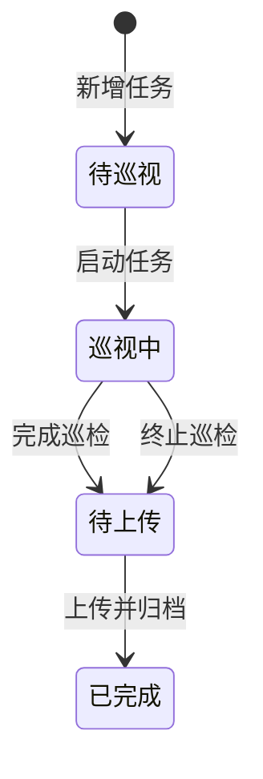
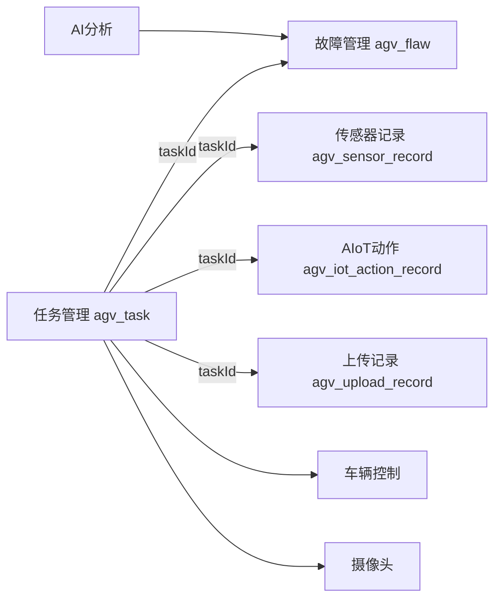

# 巡检任务管理说明

## 1. 文档目的

本文档用于说明 AGV 智能巡检系统中巡检任务管理模块的业务范围、前后端结构、任务状态、数据模型、接口设计及主要约束。

任务管理模块位于系统业务主线的中心。故障记录、传感器记录、AIoT 联动记录和上传记录均通过 `taskId` 与具体任务关联，因此任务数据是否完整、任务状态是否正确，会直接影响后续巡检执行、故障复核和数据归档。

---

## 2. 模块职责

任务管理模块负责完成一次巡检任务从创建到归档的完整管理，主要包括：

- 查询任务列表和任务详情；
- 按任务编号、创建人、执行人和状态进行筛选；
- 自动生成任务编号；
- 新增和修改任务；
- 对尚未开始的任务执行逻辑删除；
- 启动巡检任务；
- 完成或终止正在执行的任务；
- 进入任务执行页面查看车辆、视频、故障和传感器数据；
- 在任务结束后完成故障复核；
- 执行上传前检查；
- 汇总任务、故障、传感器和 AIoT 联动数据；
- 将任务归档为已完成状态。

任务管理模块不直接负责图像识别、设备底层控制或云端平台实现，但会调用这些模块提供的接口，并使用它们产生的数据。

---

## 3. 前后端文件组成

### 3.1 后端文件

```text
src/main/java/com/example/agv/
├── controller/
│   └── AgvTaskController.java
├── entity/
│   └── AgvTask.java
├── mapper/
│   └── AgvTaskMapper.java
└── service/
    ├── AgvTaskService.java
    └── CloudUploadService.java
```

任务上传和任务执行过程中还会使用：

```text
AgvFlawMapper
AgvSensorRecordMapper
AgvIotActionRecordMapper
AgvUploadRecordMapper
AgvMovementStateService
```

### 3.2 前端文件

```text
src/
├── views/
│   ├── TaskView.vue
│   ├── TaskExecuteView.vue
│   └── TaskDetailView.vue
├── components/
│   └── TaskFormDialog.vue
└── api/
    └── agv.js
```

各文件职责如下：

| 文件 | 主要职责 |
|---|---|
| `TaskView.vue` | 任务列表、筛选、分页、状态统计和操作入口 |
| `TaskFormDialog.vue` | 新增任务、修改任务和表单校验 |
| `TaskExecuteView.vue` | 实时视频、车辆控制、故障轮询和传感器联动 |
| `TaskDetailView.vue` | 任务详情、故障复核、上传检查和数据归档 |
| `agv.js` | 统一封装前端调用的任务相关接口 |
| `AgvTaskController.java` | 接收请求、校验任务状态并组织任务业务 |
| `AgvTaskMapper.java` | 基于 MyBatis-Plus 完成任务表访问 |
| `AgvTask.java` | 映射 `agv_task` 数据表 |
| `CloudUploadService.java` | 完成本地闭环或真实云端上传 |

当前版本中，`AgvTaskController` 直接调用多个 Mapper 完成主要业务。`AgvTaskService` 保留了任务查询、创建、启动、结束和上传等基础方法，后续可将控制器中的业务进一步下沉到 Service 层。

---

## 4. 任务数据模型

任务实体 `AgvTask` 对应数据库表 `agv_task`。

| 属性 | 数据库字段 | 说明 |
|---|---|---|
| `id` | `id` | 任务主键 |
| `taskCode` | `task_code` | 任务编号 |
| `taskName` | `task_name` | 任务名称 |
| `startPos` | `start_pos` | 巡检起始地点 |
| `taskTrip` | `task_trip` | 巡检距离 |
| `creator` | `creator` | 创建人 |
| `executor` | `executor` | 执行人 |
| `execTime` | `exec_time` | 任务启动时间 |
| `endTime` | `end_time` | 任务结束时间 |
| `createTime` | `create_time` | 任务创建时间 |
| `taskStatus` | `task_status` | 当前任务状态 |
| `round` | `round` | 巡检轮次 |
| `uploaded` | `uploaded` | 上传标志，0 未上传，1 已上传 |
| `remark` | `remark` | 任务备注 |
| `cloudTaskId` | `cloud_task_id` | 云端任务编号 |
| `deleteFlag` | `delete_flag` | 逻辑删除标志 |

`deleteFlag` 使用 MyBatis-Plus 的 `@TableLogic`。删除任务时不会直接清除数据库记录，而是将删除标志更新为 1。

---

## 5. 任务状态设计

系统将任务划分为四种状态：



各状态允许的操作如下：

| 状态 | 允许操作 |
|---|---|
| 待巡视 | 查看、修改、删除、启动 |
| 巡视中 | 查看实时数据、车辆控制、结束、终止 |
| 待上传 | 查看详情、复核故障、上传前检查、上传 |
| 已完成 | 查看任务、故障、传感器、联动和上传记录 |

### 5.1 状态约束

后端会对关键操作进行校验：

- 只有“待巡视”任务可以启动；
- 只有“待巡视”任务可以修改；
- 只有“待巡视”任务可以删除；
- 只有“巡视中”任务可以结束或终止；
- 只有“待上传”任务可以上传；
- 存在未确认故障时，不允许上传。

前端会根据任务状态显示或隐藏按钮，但最终业务约束以后端校验结果为准。

### 5.2 终止任务说明

终止任务不会删除本次巡检已经产生的数据。系统会：

1. 尝试发送停车指令；
2. 将任务状态改为“待上传”；
3. 写入结束时间；
4. 在备注中记录“任务被终止”；
5. 保留故障、传感器和联动记录供后续复核和归档。

---

## 6. 任务编号规则

任务编号格式为：

```text
TASK + yyyyMMdd + 四位序号
```

示例：

```text
TASK202607100001
```

生成过程：

1. 获取当前日期；
2. 生成当天前缀，例如 `TASK20260710`；
3. 查询当天编号最大的未删除任务；
4. 解析最后四位序号并加一；
5. 使用四位数字补零。

前端打开新增任务对话框时会调用编号接口提前显示编号，后端新增接口仍会进行兜底生成。

> 注意：当前实现采用“查询最大编号后加一”，高并发创建任务时可能出现编号竞争。生产环境建议增加唯一索引，并使用数据库序列、锁或失败重试机制。

---

## 7. 后端接口

任务接口统一以 `/agv/task` 为前缀。

| 功能 | 请求方式 | 接口路径 | 主要说明 |
|---|---|---|---|
| 查询任务列表 | GET | `/agv/task/list` | 支持条件查询和分页参数 |
| 查询任务详情 | GET | `/agv/task/{id}` | 根据任务主键获取详情 |
| 获取任务编号 | GET | `/agv/task/next-code` | 自动生成下一个任务编号 |
| 新增任务 | POST | `/agv/task` | 创建待巡视任务 |
| 修改任务 | PUT | `/agv/task` | 仅允许修改待巡视任务 |
| 删除任务 | DELETE | `/agv/task/{id}` | 仅允许逻辑删除待巡视任务 |
| 启动任务 | POST | `/agv/task/start/{id}` | 状态改为巡视中 |
| 结束任务 | POST | `/agv/task/end/{id}` | 完成或终止任务 |
| 上传前检查 | GET | `/agv/task/preupload/{id}` | 返回任务、故障、上传记录和汇总 |
| 上传任务 | POST | `/agv/task/upload/{id}` | 汇总并上传任务相关数据 |

### 7.1 列表查询参数

```text
taskCode
creator
executor
taskStatus
pageNum
pageSize
```

查询规则：

- `taskCode`、`creator`、`executor` 使用模糊查询；
- `taskStatus` 使用精确查询；
- 只查询 `delete_flag=0` 的任务；
- 按创建时间倒序排列。

当前实现先查询全部匹配数据，再使用 `subList` 完成内存分页。课程项目数据量下可以正常使用；数据量增大时应改用 MyBatis-Plus 的 `Page` 和 `selectPage`。

### 7.2 新增任务默认值

新增任务时后端设置：

```text
taskStatus = 待巡视
uploaded   = 0
deleteFlag = 0
createTime = 当前时间
round      = 1（未填写时）
```

### 7.3 上传前检查返回内容

上传前检查会返回：

```text
task
flaws
uploadRecords
summary
```

`summary` 中包含：

| 字段 | 含义 |
|---|---|
| `taskId` | 任务主键 |
| `taskStatus` | 当前状态 |
| `flawCount` | 故障总数 |
| `unconfirmedCount` | 未确认故障数 |
| `notUploadedFlawCount` | 未上传故障数 |
| `canUpload` | 是否满足上传条件 |

后端允许上传的条件为：

```text
任务状态为“待上传”并且未确认故障数为 0
```

### 7.4 上传处理内容

上传接口会依次执行：

1. 查询任务并校验状态；
2. 查询任务下全部故障；
3. 拒绝存在未确认故障的任务；
4. 查询上传记录；
5. 查询传感器记录；
6. 查询 AIoT 动作记录；
7. 调用 `CloudUploadService`；
8. 将任务状态改为“已完成”；
9. 将任务上传标志改为 1；
10. 将关联故障标记为已上传；
11. 新增或更新上传记录；
12. 返回任务、故障、传感器、联动和上传结果。

---

## 8. 与其他模块的数据关系



关联说明：

- 故障记录通过 `task_id` 归属具体任务；
- 传感器记录通过 `task_id` 保存巡检位置和采集值；
- AIoT 记录通过 `task_id` 保存场景、设备动作和反馈；
- 上传记录通过 `task_id` 保存上传状态和结果；
- 车辆控制接口不直接写入任务表，但执行页基于当前任务发送指令；
- AI 裂缝分析结果会写入故障表，并归属当前任务。

---

## 9. 数据库与运行配置

后端默认端口：

```text
8088
```

数据库可以通过 Spring Profile 切换：

```yaml
spring:
  profiles:
    active: mysql
```

或：

```yaml
spring:
  profiles:
    active: kingbase
```

相关脚本：

```text
src/main/resources/schema.sql
src/main/resources/data.sql
src/main/resources/schema-kingbase.sql
src/main/resources/data-kingbase.sql
```

任务模块运行前至少需要创建以下数据表：

```text
agv_task
agv_flaw
agv_sensor_record
agv_iot_action_record
agv_upload_record
agv_config
```

启动后端：

```bash
mvn spring-boot:run
```

接口连通检查：

```bash
curl "http://localhost:8088/agv/task/list?pageNum=1&pageSize=10"
```

---

## 10. 本地闭环与真实上传

后端配置项：

```yaml
agv:
  cloud-upload-enabled: false
  cloud-upload-path: /agv/task/upload
  cloud-api-key: ""
```

当 `cloud-upload-enabled=false` 时：

- 不请求远端云平台；
- 仍会完成本地任务状态、故障状态和上传记录更新；
- 适合课堂演示和离线测试。

当 `cloud-upload-enabled=true` 时：

- 从系统配置中读取云端地址；
- 将任务、故障、传感器、联动和上传清单发送到远端；
- 远端失败时，接口返回错误，不应继续将任务错误标记为已完成。

真实数据库密码、摄像头认证信息、Dify Key 和云端 Key 不应写入公开文档或提交到代码仓库。

---

## 11. 当前实现注意事项

1. `AgvTaskController` 中业务较多，后续可进一步下沉至 Service 层。
2. 上传过程包含多次数据库更新，建议后续增加事务控制。
3. 更新接口直接接收实体对象，建议生产环境使用 DTO 限制可修改字段。
4. 任务编号生成应增加唯一索引。
5. 列表分页应在数据量较大时下推到数据库。
6. 前端状态统计中的分类数量基于当前页任务，不代表全库数量。
7. 前端详情页当前要求“故障总数大于 0 且全部确认”才允许点击上传，而后端允许无故障任务上传。后续建议统一以服务端 `summary.canUpload` 为准。
8. 前端隐藏按钮不能替代后端状态校验。
